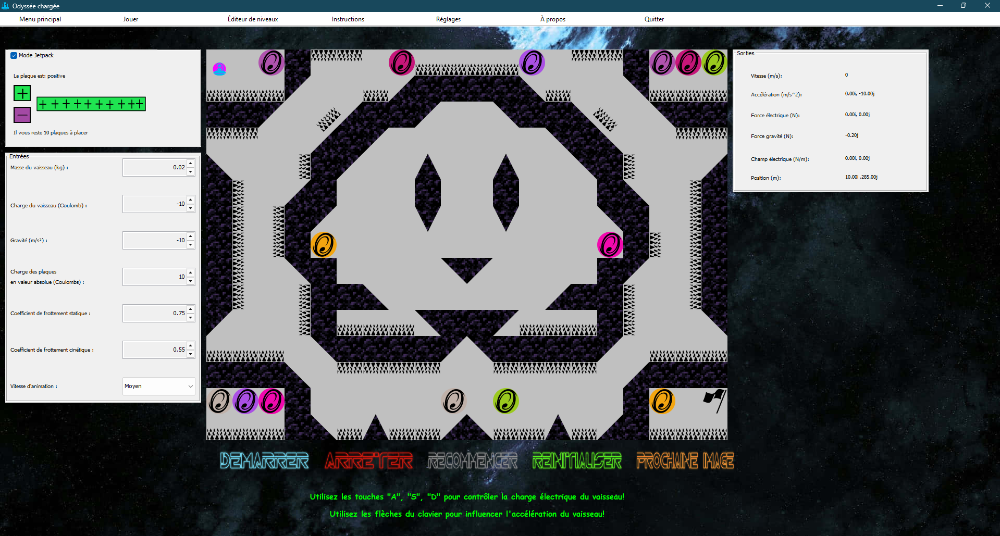

# Odyssée Chargée

## 🎮 About The Game

Odyssée Chargée is an innovative physics-based simulation game that brings electrical concepts to life through engaging gameplay. Navigate a charged spaceship through challenging environments, utilizing principles of electric attraction and repulsion to overcome obstacles. This educational game seamlessly blends entertainment with physics learning, offering players a unique way to explore concepts like kinematics and dynamics in an interactive virtual space.

## ✨ Key Features

- 🚀 **Intuitive Jetpack Controls**: Master fluid movement using keyboard controls
- 🎯 **Diverse Level Selection**: Choose from pre-designed levels or community creations
- ⚡ **Dynamic Charge System**: Strategically modify your ship's charge for tactical advantages
- 💥 **Realistic Physics Engine**: Experience true-to-life collision mechanics and electric field interactions
- 🔨 **Custom Level Editor**: Design and share your own challenges using our user-friendly editor

## 🚀 Getting Started

### Prerequisites

- Java 17 or higher ([Download here](https://www.oracle.com/java/technologies/javase/jdk17-archive-downloads.html))
- Git (for cloning the repository)

## 📚 Documentation

JavaDoc documentation for all public members is available in the `doc/` directory. To view:
1. Navigate to the `doc/` folder
2. Open `index.html` in your web browser

## 🎮 How to Play

### Controls
- **Arrow Keys**: Navigate in Jetpack mode
- **A/S/D**: Toggle charge polarity

### Gameplay Tips
- Use your ship's charge to repel from or attract to charged obstacles
- Experiment with different charge levels for optimal navigation
- Create custom levels to challenge friends or the community

## 🛠️ Development

### Building with Ant
The project includes a `build.xml` file for Ant-based building:
- `ant compile`: Compiles the source code
- `ant jar`: Creates the executable JAR
- `ant javadoc`: Generates JavaDoc documentation
- `ant clean`: Cleans build artifacts

## 🎥 Demo

Watch our gameplay demonstration:
[Odyssée Chargée Demo Video](https://youtu.be/X7LkB-zn0os)

## 🙏 Acknowledgments

- Special thanks to our physics advisors for ensuring scientific accuracy
- The open-source community for invaluable tools and libraries
- Our beta testers for their feedback and suggestions

---

Made with ❤️ by the Odyssée Chargée Team
