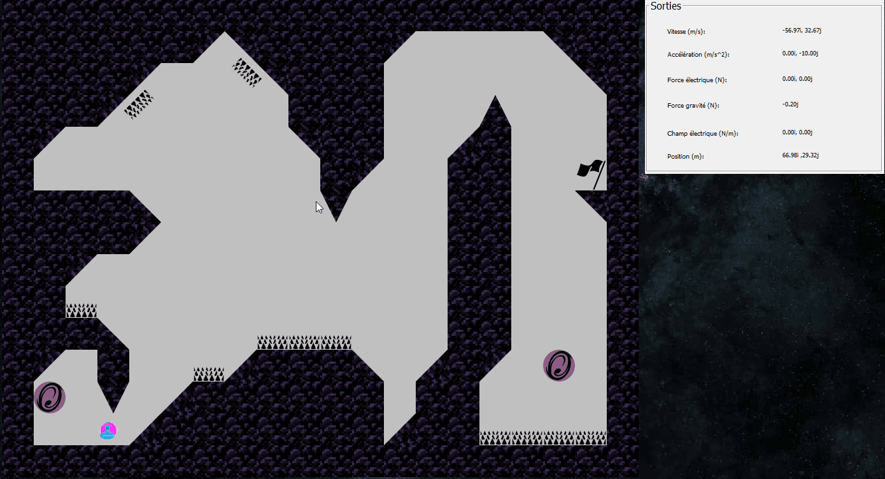
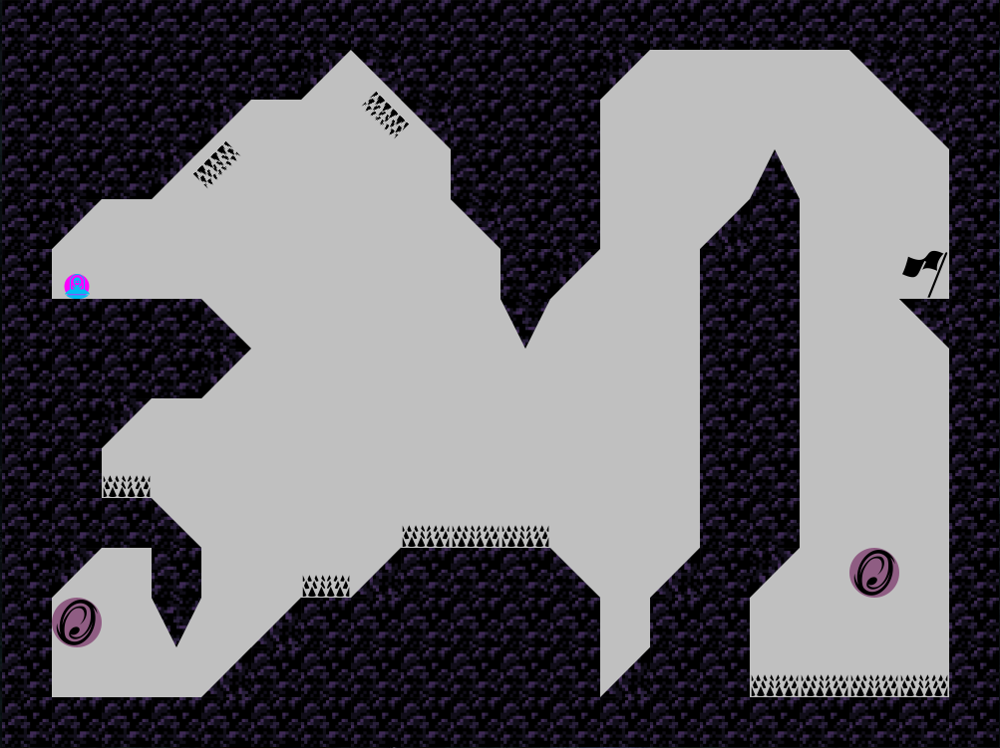
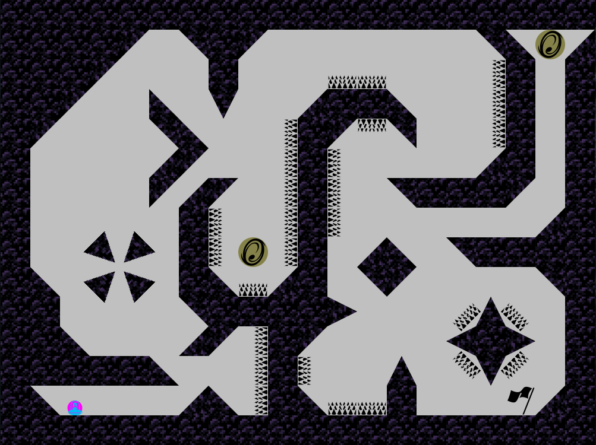
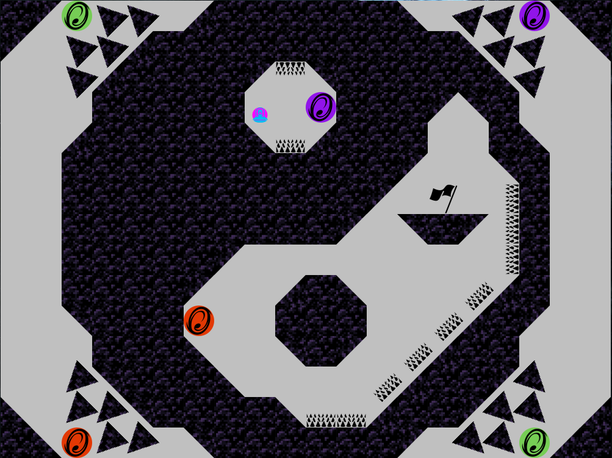
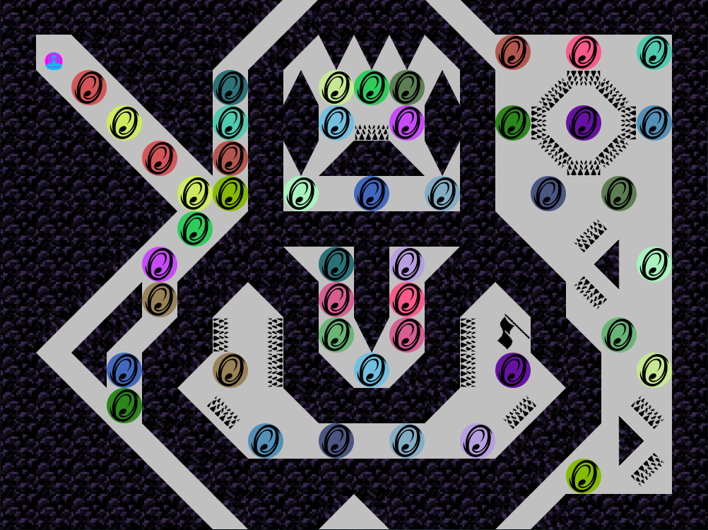
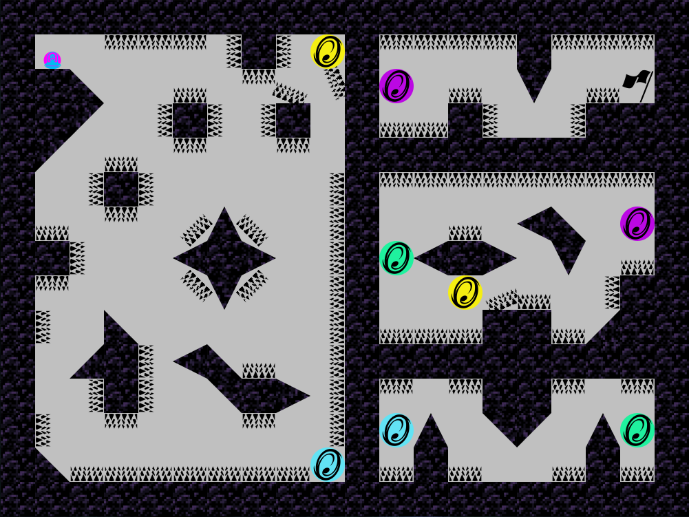
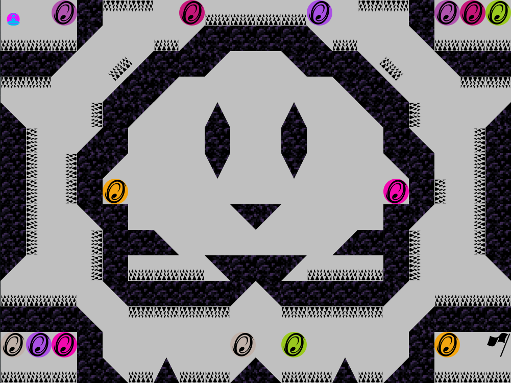

# Odyssée Chargée

A 2D physics-based game built entirely in Java Swing, with real-time
rigid-body simulation, electromagnetic plate mechanics, portal teleportation,
and a built-in level editor. No external game engine was used.

[](https://openjdk.org/)
[](https://xajason.github.io/odyssee-chargee/)
[](#license)



---

## Table of Contents

- [Features](#features)
- [Demo](#demo)
- [Technical Highlights](#technical-highlights)
- [Architecture](#architecture)
- [How to Run](#how-to-run)
- [Built With](#built-with)
- [Project Structure](#project-structure)
- [What We Would Improve](#what-we-would-improve)
- [Authors](#authors)
- [License](#license)

---

## Features

- **Real-time physics engine:** custom semi-implicit Euler integrator handling
  gravity, collision response, static and kinetic friction, and force summation
  per tick
- **Electromagnetic plates:** place charged tiles that push or pull the ship
  using Coulomb's law, turning each level into an electrostatics puzzle
- **Portal teleportation:** linked portal pairs with configurable cooldown
  timers that scale with simulation speed
- **Jetpack mode:** keyboard-driven thrust in all four directions on top of
  gravitational and electrical forces
- **Level editor:** tile-based grid editor supporting squares, equilateral and
  right triangles, spike traps, flags, portals, and ship spawn points with
  post-placement rotation
- **Level serialization:** save and load custom levels as `.dat` files via
  Java object serialization with cross-platform path resolution
- **6 bundled campaign levels** that progressively introduce core mechanics
- **Background music and volume control:** looping audio with a live settings
  panel
- **Hosted Javadoc:** API documentation published to GitHub Pages via CI

---

## Demo

### Gameplay


### Level Editor


### Electromagnetic Plates


---

## Technical Highlights

The physics engine uses a semi-implicit Euler integrator with a configurable
delta-t, keeping trajectories stable even at high velocities. Collision
detection works per-segment for arbitrary convex tile shapes, with automatic
position correction on penetration. Every frame, the engine sums gravitational
force, Coulomb electric force, normal force, static and kinetic friction, and
optional jetpack thrust before integrating.

Rendering runs through a custom `paintComponent` pipeline that maps real-world
metre coordinates to pixels using affine transforms and anti-aliased
`Graphics2D`. No sprites are scaled at runtime; all geometry is computed
analytically.

Levels are fully serialized via `ObjectOutputStream` and saved to a
cross-platform path resolved using `java.nio.file.Path`, with automatic
directory creation on first save. The whole project is structured across 39
classes in 10 packages following an MVC-inspired split between the physics
engine, model, view, and controller layers. A GitHub Actions pipeline generates
and publishes Javadoc to GitHub Pages on every push to `main`.

---

## Architecture

The entry point is `application.Main`, which manages the window and switches
between three panels: `PanelJeu`, `PanelEditeur`, and
`PanelSelecteurNiveaux`. The animation loop lives in
`ZoneAnimationPhysique`, backed by a tile grid in `Grille`. Physics
computations are split across `MoteurPhysique`, `CollisionPhysique`, and
`ForcePhysique`. Game objects are `Vaisseau`, `PlaqueChargee`, and the
`Tuile` subclass hierarchy. Math primitives (`Vecteur2D`, `Segment`,
`MatriceRotation`) sit in their own package at the bottom of the dependency
graph.

Key design decisions:

- No external libraries for physics or rendering. Every vector operation,
  collision algorithm, and electrostatic field calculation is written from
  scratch in pure Java.
- `MoteurPhysique` delegates to `CollisionPhysique` and `ForcePhysique` to
  keep each class focused on a single responsibility without breaking the
  existing API.
- The `Tuile` base class has seven subclasses (`Carre`, `TriangleEquilateral`,
  `TriangleRectangle`, `Pics`, `Drapeau`, `Portail`, `VaisseauImage`), each
  defining its own geometry and collision surface list.

---

## How to Run

### Option 1: Runnable JAR (Recommended)

1. Download `odyssee-chargee.jar` from the [Releases](../../releases) tab
2. Make sure Java 17 or newer is installed
3. Place the JAR alongside the `ressources/` directory
4. Run:

```bash
java -jar odyssee-chargee.jar
```

### Option 2: Import in Eclipse

1. Clone the repository:

```bash
git clone https://github.com/XaJason/odyssee-chargee.git
```

2. Open Eclipse and go to _File > Import > Existing Projects into Workspace_
3. Select the cloned folder
4. Run `application.Main` as a Java Application

### Option 3: Command Line

```bash
git clone https://github.com/XaJason/odyssee-chargee.git
cd odyssee-chargee
javac -encoding UTF-8 -d bin $(find src -name "*.java")
java -cp bin application.Main
```

---

## Built With

- Java 17
- Java Swing and AWT for UI and 2D rendering
- `java.nio.file` for cross-platform path resolution
- `javax.sound.sampled` for audio playback
- Java Object Serialization for level persistence
- GitHub Actions for Javadoc CI
- Eclipse IDE

---

## Project Structure

```
odyssee-chargee/
├── src/
│   ├── application/     # Entry point and app lifecycle
│   ├── dessin/          # Animation zone, tile grid, star rating
│   ├── fenetres/        # Dialog windows (settings, instructions, about)
│   ├── interactif/      # Physics-enabled game objects (ship, plates)
│   ├── math/            # Rotation matrices
│   ├── niveau/          # Level model, serialization, level manager
│   ├── panneaux/        # Game panel, editor panel, level selector
│   ├── physique/        # Physics engine (kinematics, collisions, forces)
│   ├── tuile/           # Tile hierarchy (squares, triangles, portals...)
│   └── utilitaires/     # Constants, image tools, interfaces
├── ressources/          # Images, audio, and 6 bundled level files
├── demo/                # GIFs and screenshots
├── doc/                 # Javadoc (published to GitHub Pages)
├── .github/workflows/   # CI configuration
└── README.md
```

---

## Screenshots








---

## What We Would Improve

- **UI polish:** consistent visual style across panels, tooltips, and a
  tutorial level for new players
- **Audio:** a proper audio manager with multiple simultaneous tracks and
  fade transitions
- **Test coverage:** JUnit tests for the physics engine and serialization,
  which currently rely on manual verification
- **Configurable simulation:** gravity, charge strength, friction, and ship
  mass exposed as level metadata rather than global constants
- **Performance:** spatial partitioning for collision detection to replace
  the current O(n^2) tile iteration on large grids

---

## Authors

Developed by Equipe 22 as a capstone project for course 420-SCD
(Integration des apprentissages en SIM, 200.C0) at College de Maisonneuve,
Winter 2024, under the supervision of Caroline Houle.

- Jason Xa: level editor, tile system, UI panels
- Kitimir Yim: application lifecycle, level serialization, audio
- Enuel Rene Valentin Kizozo Izia: physics engine, collision detection,
  electromagnetic force model
- Pierre-Olivier Giroux: tile geometry, portal logic, grid management

---

## License

This project was developed for academic purposes.
All rights reserved, Equipe 22, 2024.
